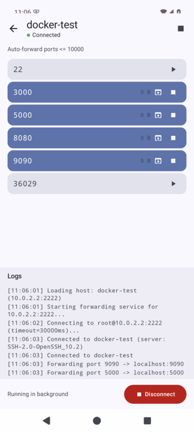

# SSH Auto Forward for Android

Android version of [ssh-auto-forward](https://github.com/alexeygrigorev/ssh-auto-forward) — automatically discover and forward SSH tunnels on your Android device.

Connects to a remote server via SSH, periodically scans for listening TCP ports, and creates local port forwards — just like VS Code's port forwarding, but on your phone.

## Features

- Auto port discovery — scans remote `ss -tlnp` every N seconds
- Automatic forwarding — ports below a configurable threshold are forwarded automatically
- Manual toggle — tap to start/stop forwarding any port
- SSH key upload — upload your private key via file picker
- Foreground service — keeps tunnels alive in the background with a persistent notification
- Auto-reconnect — exponential backoff on connection loss
- Traffic stats — shows bytes transferred per tunnel
- Open in browser — tap to open `http://127.0.0.1:<port>` on your device

## Screens



*Dashboard with auto-discovered ports forwarded from a remote server*

| Host List | Add Host | Dashboard |
|-----------|----------|-----------|
| List of configured SSH hosts with status | Configure host, upload key, set options | Live port table with toggle/open actions |

## Download

Get the latest APK from [Releases](https://github.com/alexeygrigorev/ssh-auto-forward-android/releases).

## Tech Stack

- Kotlin + Jetpack Compose
- JSch (SSH library)
- Room (SQLite persistence)
- Hilt (dependency injection)
- Foreground Service (background operation)

## Building

```bash
./gradlew assembleDebug
```

APK output: `app/build/outputs/apk/debug/app-debug.apk`

## How It Works

1. Configure an SSH host (hostname, username, private key)
2. Tap the host to connect
3. The app scans `ss -tlnp` on the remote server every 5 seconds
4. Ports ≤ 10000 (configurable) are automatically forwarded to `127.0.0.1:<port>` on your device
5. Open `http://127.0.0.1:<port>` in your browser to access the service

## Differences from Desktop Version

| Desktop (Python) | Android (Kotlin) |
|-----------------|-------------------|
| Reads `~/.ssh/config` | Custom UI for host management |
| Textual TUI with keyboard shortcuts | Compose UI with tap/long-press |
| Terminal process | Foreground service + notification |
| `paramiko` SSH library | `JSch` SSH library |

## License

WTFPL
